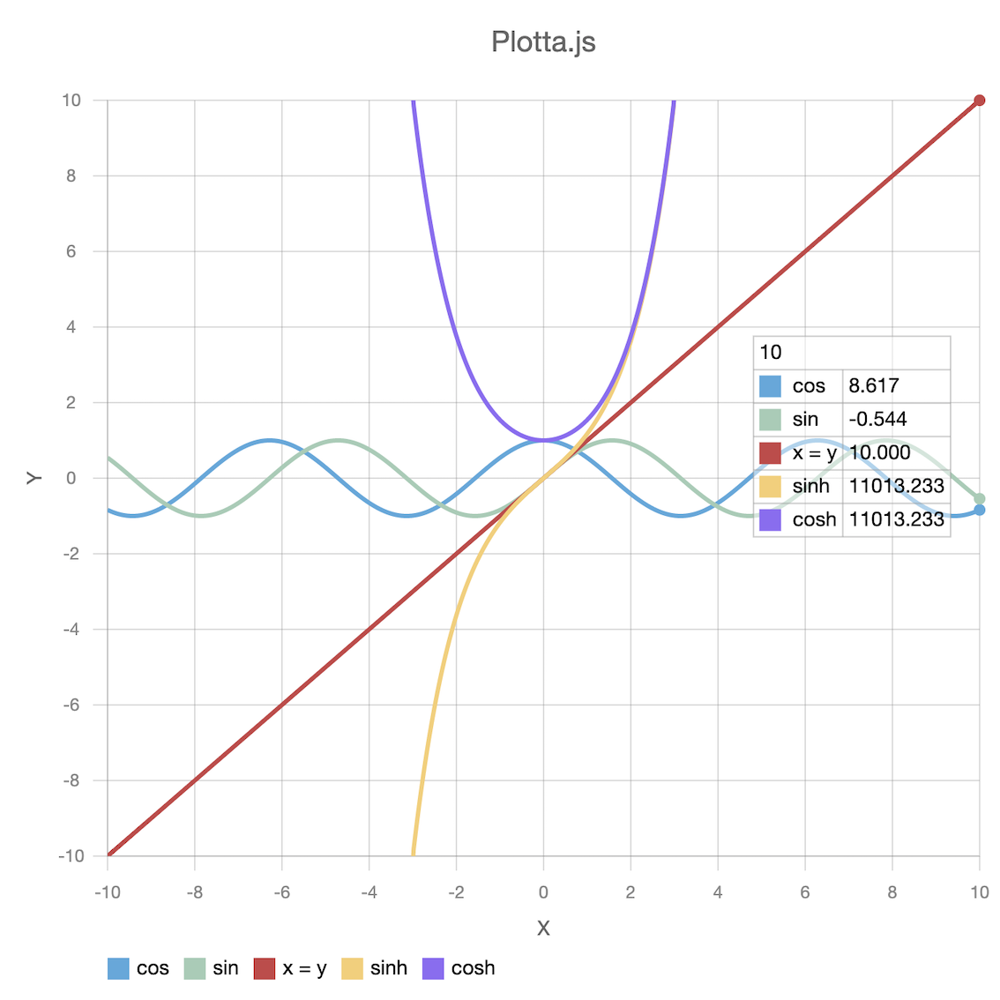

## Documentation

- [Introduction](https://iamsjy17.github.io/plotta/)
- [API Documentation & Example](https://iamsjy17.github.io/plotta/api)
- [Demo App](https://iamsjy17.github.io/plotta/demo/)

## Features

### High-performance canvas rendering

Supports high performance canvas rendering with offscreencanvas, vsync, and supports hdpi.

### User Interections

Plotta.js supports Zoom In/Zoom Out, Data table.

### Custom

You can customize various properties such as axis, grid, font, title, tics, lineDatas, and colors.

### API

Provides APIs to control various properties.

## Graph Example

## Version

1.0

## CopyLight & License

Copyright (c) 2019 Song Jewoo. Plotta.js, Plotta.js is released under the [MIT license](https://opensource.org/licenses/MIT).
