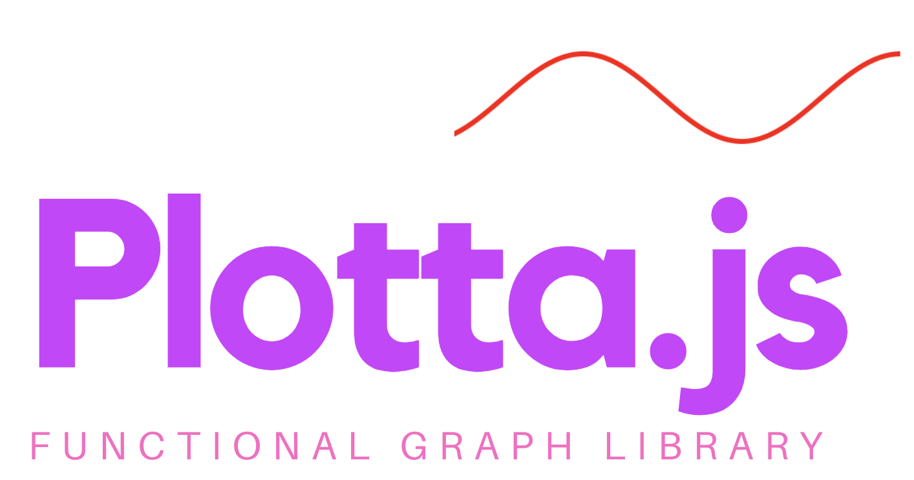
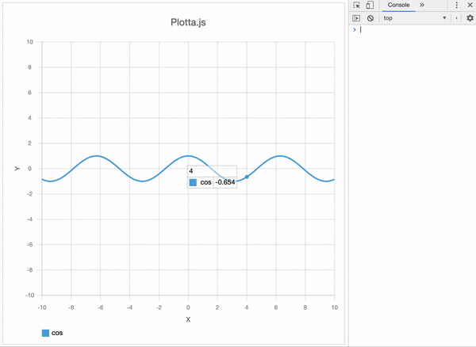

<p align="left"></a></p>

 
<a href="https://www.npmjs.com/package/plotta.js"></a>

`Plotta.js` is a Open Source JavaScript library that plot mathematical functions And Datas.
`Plotta.js` Renders using an HTML5 Canvas.

<p align="left"></a></p>

## Features

#### HTML5 Canvas

Plotta.js uses HTML5 Canvas without library dependency.

#### User Interections

Plotta.js supports Zoom In/Zoom Out, Data table.

#### Custom

You can customize various properties such as axis, grid, font, title, tics, lineDatas, and colors.

<p align="left"></a></p>

## Demo

https://iamsjy17.github.io/plotta.js-page/

## Version

1.1.1

## RoadMap

#### 1.0

- April 2019, Initial Release
- only supports Chrome and whale browsers.

#### 1.1

- Coming in July 2019
- Added more documentation on usage and examples.
- Supports all major browsers.

#### 1.2

- Coming in 2021
- Feature: Line Types.(Dotted lines, stick lines, Bar etc.)
- Feature: Add export related API(SaveAsImage, SaveAsPDF)
- Feature: Move coordinate system by dragging mouse

## Browser Support

| Chrome | Interner Exploer |  Edge  | Safari | FireFox | Whale  |
| :----: | :--------------: | :----: | :----: | :-----: | :----: |
| Latest |        9+        | Latest | Latest | Latest  | Latest |

## Download

#### Development

Uncompressed file for development

- https://iamsjy17.github.io/plotta.js-page/release/latest/plotta.js
- https://iamsjy17.github.io/plotta.js-page/release/[VERSION]/plotta.js

#### Production

Compressed file for Production

- https://iamsjy17.github.io/plotta.js-page/release/latest/plotta.min.js
- https://iamsjy17.github.io/plotta.js-page/release/[VERSION]/plotta.min.js

## Install

```bash
$ npm install plotta.js
```

## Usage

### HTML

```html
<canvas
  id="canvas"
  width="700px"
  height="700px"
  style="width:700px; height:700px; border:1px solid #d3d3d3;"
></canvas>
```

### Javascript

```js
const canvas = document.getElementById('canvas');
const plotta = new Plotta(canvas, {
  linedatas: [
    {
      id: 'line1',
      type: 'func',
      legend: 'cos',
      color: '#55A8DE',
      visible: true,
      func: Math.cos,
      dotNum: 1000,
    },
  ],
  config: {
    title: {
      location: 'center',
      color: '#666666',
      text: 'Plotta.js',
    },
    grid: {
      visible: true,
      color: '#888888',
    },
    border: {
      visible: true,
      color: '#DDDDDD',
      width: 1,
    },
  },
});
```

## API Documentation

Provides APIs to control various properties.

- Graph
  - [UpdateGraph](#updategraph)
- Line
  - [AddLine](#addline)
  - [DeleteLine](#deleteline)
- Font
  - [SetFont](#setfont)
- Title
  - [SetTitle](#settitle)
  - [SetTitleColor](#settitlecolor)
  - [SetTitleLocation](#settitlelocation)
- Grid
  - [ShowGrid](#showaxisxlabel)
  - [SetGridColor](#setgridcolor)
- Border
  - [ShowBorder](#showborder)
  - [SetBorderColor](#setbordercolor)
  - [SetBorderWidth](#setborderwidth)
- Tics
  - [ShowTics](#showtics)
  - [SetTicsColor](#setticscolor)
  - [SetTicsValue](#setticsvalue)
- Axis
  - [ShowAxisXLabel](#showaxisxlabel)
  - [SetAxisXLabel](#setaxisxlabel)
  - [SetAxisXLabelColor](#setaxisxlabelcolor)
  - [SetAxisXLabelLocation](#setaxisxlabellocation)
  - [ShowAxisYLabel](#showaxisylabel)
  - [SetAxisYLabel](#setaxisylabel)
  - [SetAxisYLabelColor](#setaxisylabelcolor)
  - [SetAxisYLabelLocation](#setaxisylabellocation)
- Table
  - [ShowTable](#showtable)

### UpdateGraph

##### Description

Update all graph data And only the properties of the dataSet object with the properties of the graph.

> Plotta.UpdateGraph(dataSet);

##### Parameters

|  Name   | Type   | Description        |
| :-----: | ------ | ------------------ |
| dataSet | Object | Data set to update |

##### Example

Update `line1`, gridVisible, gridColor, borderVisible, borderColor, borderWidth.

```js
Plotta.UpdateGraph({
  linedatas: [
    {
      id: 'line1',
      type: 'func',
      legend: 'cos',
      color: '#55A8DE',
      visible: true,
      func: Math.cos,
      dotNum: 1000,
    },
  ],
  config: {
    grid: {
      visible: true,
      color: '#888888',
    },
    border: {
      visible: true,
      color: '#DDDDDD',
      width: 1,
    },
  },
});
```

### AddLine

##### Description

Add New Line. If it is an existing id, it is not added.

> Plotta.AddLine(lineData);

##### Parameters

|   Name   | Type   | Description         |
| :------: | ------ | ------------------- |
| lineData | Object | LineData set to Add |

##### Example

```js
Plotta.AddLine({
  id: 'line1',
  type: 'func',
  legend: 'cos',
  color: '#55A8DE',
  visible: true,
  func: Math.cos,
  dotNum: 1000,
});
```

### DeleteLine

##### Description

Delete the line that matches the id you entered.

> Plotta.DeleteLine(id);

##### Parameters

| Name | Type   | Description              |
| :--: | ------ | ------------------------ |
|  id  | String | Id of the line to delete |

##### Example

```js
Plotta.DeleteLine('line1');
```

### SetFont

##### Description

Set the font.

> Plotta.SetFont(font);

##### Parameters

| Name | Type   | Description |
| :--: | ------ | ----------- |
| font | String | font        |

##### Example

```js
Plotta.SetFont(`Helvetica Neue', Helvetica, Arial, sans-serif`);
```

### SetTitle

##### Description

Set the graph title.

> Plotta.SetTitle(title);

##### Parameters

| Name  | Type   | Description |
| :---: | ------ | ----------- |
| title | String | Graph Title |

##### Example

```js
Plotta.SetTitle('Hello Graph');
```

### SetTitleColor

##### Description

set color of graph title.

> Plotta.SetTitleColor(color);

##### Parameters

| Name  | Type   | Description                            |
| :---: | ------ | -------------------------------------- |
| color | String | it is parsed as a CSS `<color>` value. |

##### Example

```js
Plotta.SetTitleColor(`#FFA500`);
```

### SetTitleLocation

##### Description

Set the location of the title.

> Plotta.SetTitleLocation(location);

##### Parameters

The default value is center.

|   Name   | Type   | Description                          |
| :------: | ------ | ------------------------------------ |
| location | String | Enter either left, center, or right. |

##### Example

```js
Plotta.SetTitleLocation('left');
```

### ShowGrid

##### Description

Set the visibility value of the grid.

> Plotta.ShowGrid(show);

##### Parameters

| Name | Type    | Description                   |
| :--: | ------- | ----------------------------- |
| show | boolean | visibility value of the grid. |

##### Example

```js
Plotta.ShowGrid(true);
```

### SetGridColor

##### Description

set color of grid.

> Plotta.SetGridColor(color);

##### Parameters

| Name  | Type   | Description                            |
| :---: | ------ | -------------------------------------- |
| color | String | it is parsed as a CSS `<color>` value. |

##### Example

```js
Plotta.SetGridColor(`orange`);
```

### ShowBorder

##### Description

Set the visibility value of the border.

> Plotta.ShowBorder(show);

##### Parameters

| Name | Type    | Description                     |
| :--: | ------- | ------------------------------- |
| show | boolean | visibility value of the border. |

##### Example

```js
Plotta.ShowBorder(false);
```

### SetBorderColor

##### Description

set color of border.

> Plotta.SetBorderColor(color);

##### Parameters

| Name  | Type   | Description                            |
| :---: | ------ | -------------------------------------- |
| color | String | it is parsed as a CSS `<color>` value. |

##### Example

```js
Plotta.SetGridColor(`black`);
```

### SetBorderWidth

##### Description

set width of border.

> Plotta.SetBorderWidth(width);

##### Parameters

| Name  | Type   | Description     |
| :---: | ------ | --------------- |
| width | Number | width of border |

##### Example

```js
Plotta.SetBorderWidth(1);
```

### ShowTics

##### Description

Set the visibility value of the ticks.

> Plotta.ShowTics(show);

##### Parameters

| Name | Type    | Description                    |
| :--: | ------- | ------------------------------ |
| show | boolean | visibility value of the ticks. |

##### Example

```js
Plotta.ShowTics(true);
```

### SetTicsColor

##### Description

set color of ticks.

> Plotta.SetTicsColor(color);

##### Parameters

| Name  | Type   | Description                            |
| :---: | ------ | -------------------------------------- |
| color | String | it is parsed as a CSS `<color>` value. |

##### Example

```js
Plotta.SetTicsColor(`#888888`);
```

### SetTicsValue

##### Description

Set the tick value object.
The `tick value` is the unit size of a tick on the x and y axes.

> Plotta.SetTicsValue(value);

##### Parameters

| Name  | Type   | Description                             |
| :---: | ------ | --------------------------------------- |
| value | Object | An Object with x, y ticks as properties |

##### Example

```js
Plotta.SetTicsValue({ x: 2, y: 2 });
```

### ShowAxisXLabel

##### Description

Set the visibility value of the X axis label.

> Plotta.ShowAxisXLabel(show);

##### Parameters

| Name | Type    | Description                           |
| :--: | ------- | ------------------------------------- |
| show | boolean | visibility value of the X axis label. |

##### Example

```js
Plotta.ShowAxisXLabel(true);
```

### SetAxisXLabel

##### Description

Set the X axis label.

> Plotta.SetAxisXLabel(lebel);

##### Parameters

| Name  | Type   | Description   |
| :---: | ------ | ------------- |
| lebel | String | X axis label. |

##### Example

```js
Plotta.SetAxisXLabel('X label');
```

### SetAxisXLabelColor

##### Description

set color of X axis label.

> Plotta.SetAxisXLabelColor(color);

##### Parameters

| Name  | Type   | Description                            |
| :---: | ------ | -------------------------------------- |
| color | String | it is parsed as a CSS `<color>` value. |

##### Example

```js
Plotta.SetAxisXLabelColor(`#888888`);
```

### SetAxisXLabelLocation

##### Description

Set the location of the X axis label.

> Plotta.SetAxisXLabelLocation(location);

##### Parameters

The default value is center.

|   Name   | Type   | Description                          |
| :------: | ------ | ------------------------------------ |
| location | String | Enter either left, center, or right. |

##### Example

```js
Plotta.SetAxisXLabelLocation('center');
```

### ShowAxisYLabel

##### Description

Set the visibility value of the Y axis label.

> Plotta.ShowAxisYLabel(show);

##### Parameters

| Name | Type    | Description                           |
| :--: | ------- | ------------------------------------- |
| show | boolean | visibility value of the X axis label. |

##### Example

```js
Plotta.ShowAxisYLabel(true);
```

### SetAxisYLabel

##### Description

Set the Y axis label.

> Plotta.SetAxisYLabel(lebel);

##### Parameters

| Name  | Type   | Description   |
| :---: | ------ | ------------- |
| lebel | String | X axis label. |

##### Example

```js
Plotta.SetAxisXLabel('Y label');
```

### SetAxisYLabelColor

##### Description

set color of Y axis label.

> Plotta.SetAxisYLabelColor(color);

##### Parameters

| Name  | Type   | Description                            |
| :---: | ------ | -------------------------------------- |
| color | String | it is parsed as a CSS `<color>` value. |

##### Example

```js
Plotta.SetAxisYLabelColor(`#888888`);
```

### SetAxisYLabelLocation

##### Description

Set the location of the Y axis label.

> Plotta.SetAxisYLabelLocation(location);

##### Parameters

The default value is center.

|   Name   | Type   | Description                          |
| :------: | ------ | ------------------------------------ |
| location | String | Enter either top, middle, or bottom. |

##### Example

```js
Plotta.SetAxisYLabelLocation('middle');
```

### ShowTable

##### Description

Set the visibility value of the Table.

> Plotta.ShowTable(show);

##### Parameters

| Name | Type    | Description                    |
| :--: | ------- | ------------------------------ |
| show | boolean | visibility value of the Table. |

##### Example

```js
Plotta.ShowTable(true);
```

## Commit Message Convention

- https://www.conventionalcommits.org/en/v1.0.0/

## CopyLight & License

Copyright (c) 2019 Song Jewoo. Plotta.js, Plotta.js is released under the [MIT license](https://opensource.org/licenses/MIT).
